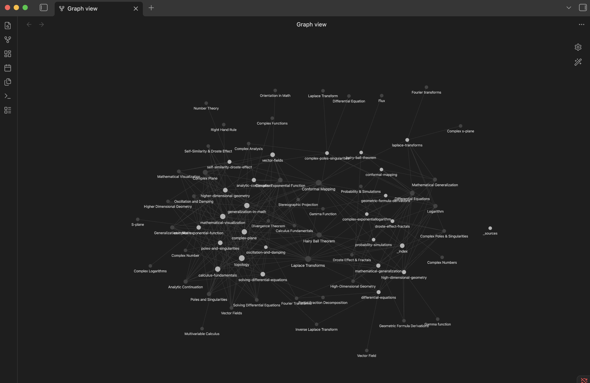

<p align="center">
  <h1 align="center">yt-to-knowledge</h1>
  <p align="center"><strong>Turn any YouTube channel into an Obsidian knowledge base.</strong></p>
</p>

<p align="center">
  
  
  
  
</p>

---

<p align="center">
  
</p>

> **5 videos from 3Blue1Brown → 11 interconnected wiki articles in 5 minutes. Zero cost.**

## What it does

```
YouTube Channel --> Transcripts --> Smart Chunks --> Gemini Compilation --> Obsidian Vault
```

Give it a YouTube channel. It downloads every transcript, identifies key topics, and compiles them into interconnected wiki articles with `[[backlinks]]` -- ready to open in Obsidian.

## Quick Start

```bash
pip install -r requirements.txt
export GEMINI_API_KEY=your_key_here

# Turn 3Blue1Brown into a knowledge base
python -m src --channel @3blue1brown --output ./3b1b-vault

# Just the latest 20 videos from Lex Fridman
python -m src --channel @lexfridman --output ./lex-vault --max-videos 20

# A specific playlist
python -m src --playlist PLZHQObOWTQDNU6R1 --output ./math-vault

# Build with search index (optional)
python -m src --channel @3blue1brown --output ./3b1b-vault --search

# Query the index later
python -m src --query "eigenvalues in PageRank" --output ./3b1b-vault
```

Then open the output folder in Obsidian. You'll see a graph of interconnected articles compiled from the channel's content.

## Demo: 3Blue1Brown → Knowledge Base

```
$ python -m src --channel @3blue1brown --output ./3b1b-vault --max-videos 5

Listing videos from channel...
Found 5 videos. Fetching transcripts...
  [1/5] How (and why) to take a logarithm of an image... ok
  [2/5] The most beautiful formula not enough people understand... ok
  [3/5] The Hairy Ball Theorem... ok
  [4/5] Why Laplace transforms are so useful... ok
  [5/5] But what is a Laplace Transform?... ok

Chunking 5 transcripts...
Created 61 chunks from 5 transcripts.

Compiling wiki articles with Gemini...
Identifying key topics across the channel...
Identified 11 topics.
  Compiling article [1/11]: Hairy Ball Theorem...
  Compiling article [2/11]: Laplace Transforms...
  ...
  Compiling article [11/11]: Droste Effect & Fractals...

Vault complete: 11 articles + index + sources
Done in 5m 23s.
```

**Generated index (`_index.md`):**

```markdown
- [[Complex Exponential/Logarithm]] `Complex Numbers`, `Exponential Functions`
- [[Complex Poles & Singularities]] `Complex Analysis`, `S-plane`
- [[Conformal Mapping]] `Complex Analysis`, `Geometry`
- [[Differential Equations]] `Calculus`, `Modeling`, `Physics`
- [[Hairy Ball Theorem]] `Topology`, `Vector Fields`, `Sphere`
- [[Laplace Transforms]] `Differential Equations`, `Signal Processing`
- [[Probability & Simulations]] `Probability`, `Monte Carlo`
... (11 articles total)
```

Each article synthesizes content from multiple videos, includes `[[backlinks]]` to related topics, and links back to the source YouTube videos.

## How it works

| Step | What happens |
|------|-------------|
| **Fetch** | yt-dlp downloads transcripts in parallel (5 concurrent, with resume support) |
| **Chunk** | Splits transcripts at natural topic boundaries (~500-800 words each) |
| **Compile** | Gemini reads all chunks, identifies 10-20 key topics, writes wiki articles with cross-references |
| **Write** | Outputs Obsidian-compatible `.md` files with `[[backlinks]]`, YAML frontmatter, and source attribution |
| **Search** *(optional)* | Embeds chunks with MiniLM, builds FAISS index for semantic search across raw transcripts |

## Output Structure

```
vault/
├── _index.md                    # Master topic index
├── _sources.md                  # All videos processed
├── linear-algebra-essentials.md # Wiki article with [[backlinks]]
├── fourier-transforms.md        # Another article, linked to the first
├── neural-network-basics.md
├── ... (10-20 articles per channel)
└── search/                      # Only with --search flag
    ├── chunks.faiss             # FAISS vector index
    └── metadata.json            # Chunk metadata for results
```

Each article includes:

| Component | Description |
|-----------|------------|
| YAML frontmatter | Title, tags, source video links |
| Compiled content | Synthesized from multiple videos on the same topic |
| `[[backlinks]]` | Obsidian-style links to related articles in the vault |
| Source attribution | Direct YouTube links to original videos |

## Architecture

```
src/
├── __main__.py   # CLI entry point (argparse)
├── fetcher.py    # yt-dlp transcript download (async, parallel, resume)
├── chunker.py    # Smart text splitting at topic boundaries
├── compiler.py   # Gemini topic identification + article generation
├── vault.py      # Obsidian markdown writer with frontmatter + index
└── search.py     # FAISS semantic search over chunks (optional)
```

## Why this over alternatives?

| | yt-to-knowledge | Typical RAG scrapers | NotebookLM |
|---|---|---|---|
| Output | Obsidian wiki with `[[backlinks]]` | Raw transcript chunks | Podcast / chat |
| Synthesizes across videos | Yes (Gemini compiles topics) | No (just indexes) | Partial |
| Semantic search | Yes (`--search` flag) | Yes | No export |
| Obsidian graph view | Yes | No | No |
| Cost | Free (Gemini free tier) | Free | Free (limited) |
| Self-hosted | Yes | Yes | No |
| Works offline after build | Yes | Yes | No |

Most YouTube-to-RAG tools stop at **indexing chunks** -- you search, you get raw transcript snippets. That's ctrl+F with extra steps.

This tool **synthesizes** a channel's knowledge. One article might pull insights from 5 different videos on the same topic, with cross-references to related concepts. You get a knowledge base you can actually *read*, not just query.

And if you still want raw search, `--search` builds a FAISS index on top -- best of both worlds.

## CLI Options

| Flag | Default | Description |
|------|---------|-------------|
| `--channel` | -- | YouTube channel URL or @handle |
| `--playlist` | -- | YouTube playlist ID |
| `--output` | `./output` | Output directory for the vault |
| `--max-videos` | `100` | Maximum number of videos to process |
| `--lang` | `en` | Subtitle language code |
| `--search` | off | Build FAISS search index over chunks |
| `--query` | -- | Search the index (standalone, no fetching) |
| `--top-k` | `5` | Number of search results to return |

## Cost

Gemini 2.5 Flash free tier handles 1,500 requests/day. A 100-video channel uses ~30-50 requests. Effectively free.

## Tech Stack

| Tool | Purpose |
|------|---------|
| [yt-dlp](https://github.com/yt-dlp/yt-dlp) | Video listing + transcript extraction |
| [Gemini 2.5 Flash](https://ai.google.dev/) | Topic identification + article compilation |
| [Obsidian](https://obsidian.md/) | Target knowledge base format |
| [FAISS](https://github.com/facebookresearch/faiss) | Vector similarity search *(optional)* |
| [sentence-transformers](https://sbert.net/) | Chunk embeddings *(optional)* |

---

Built by [Sarthak Goel](https://sarthakgoel.cv)
